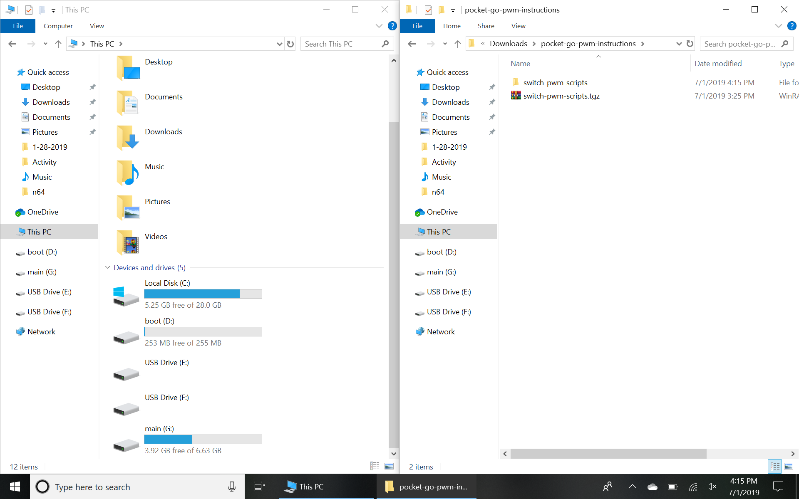
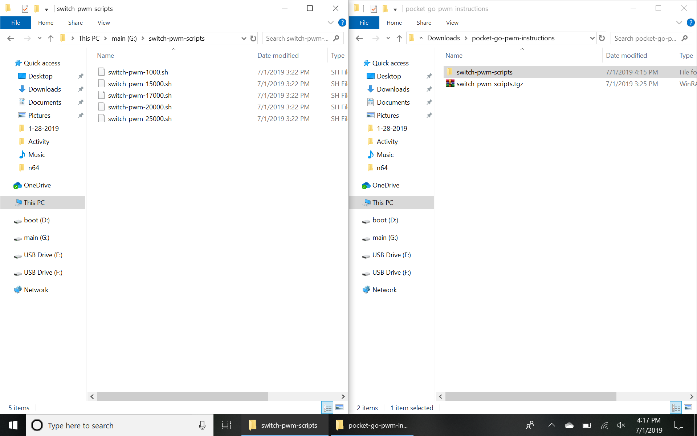
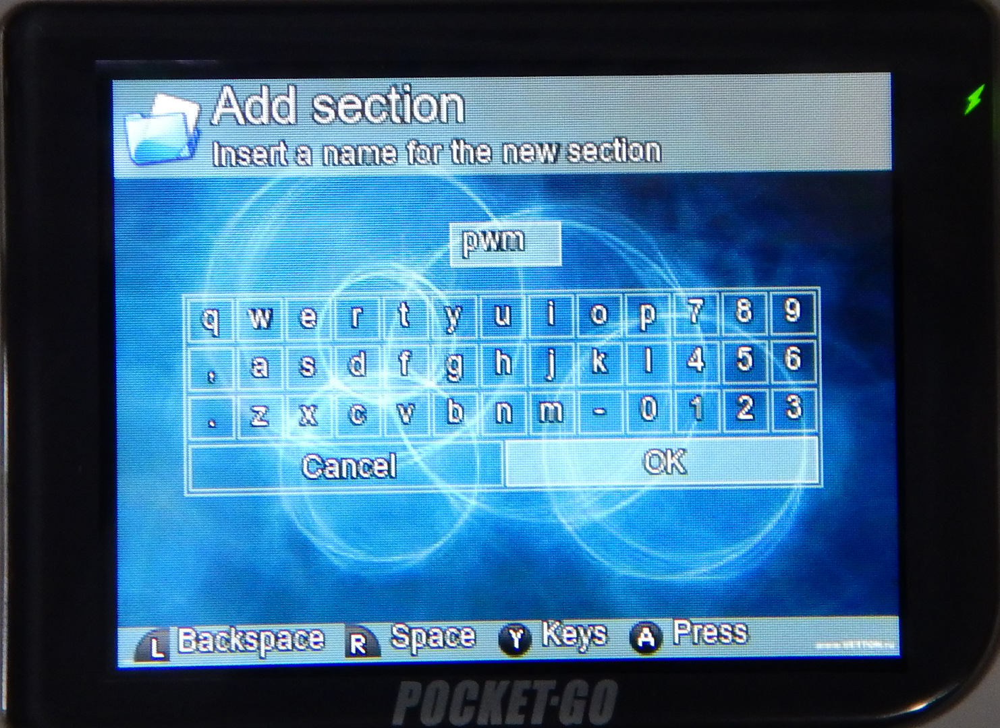
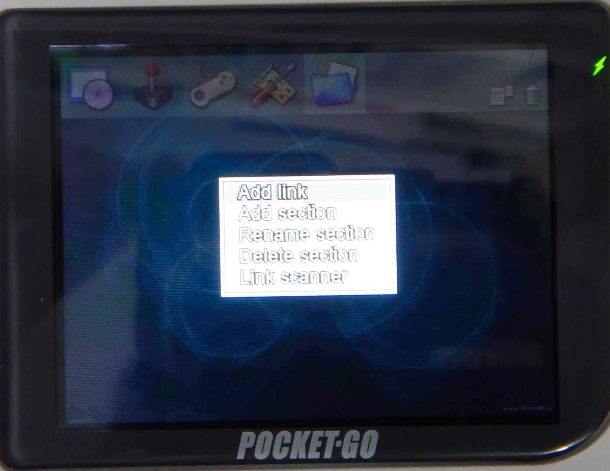
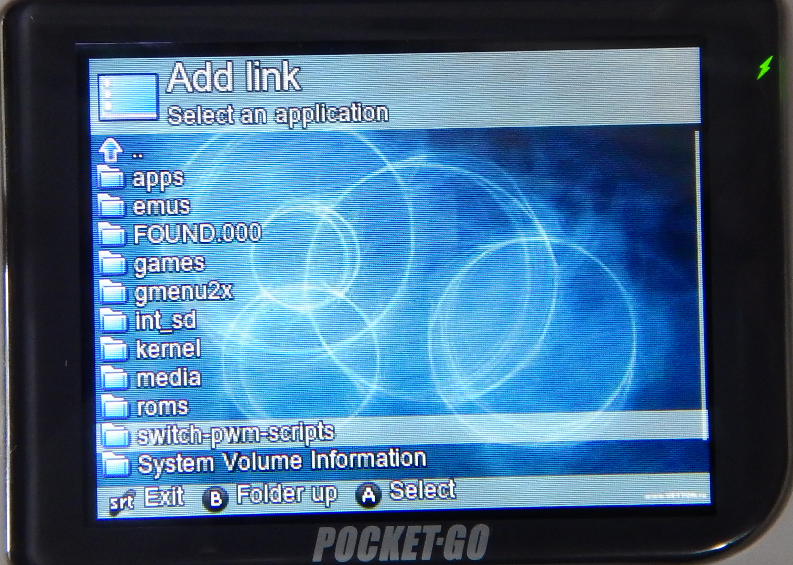
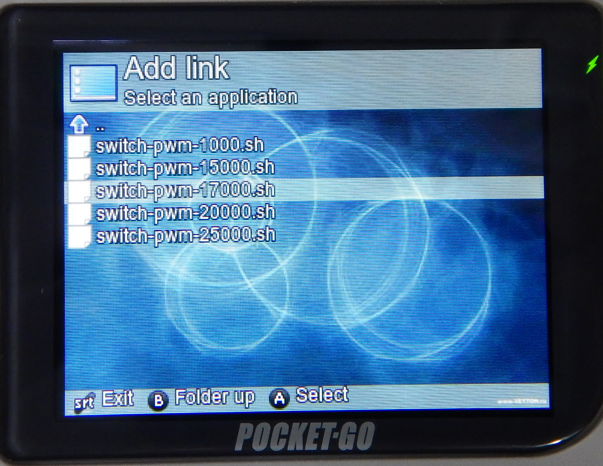
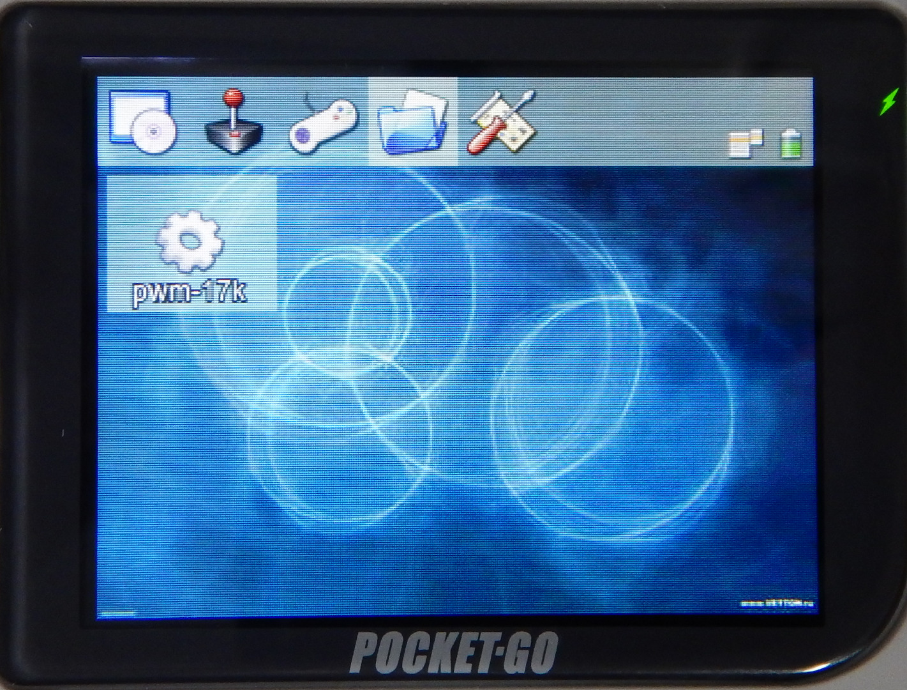
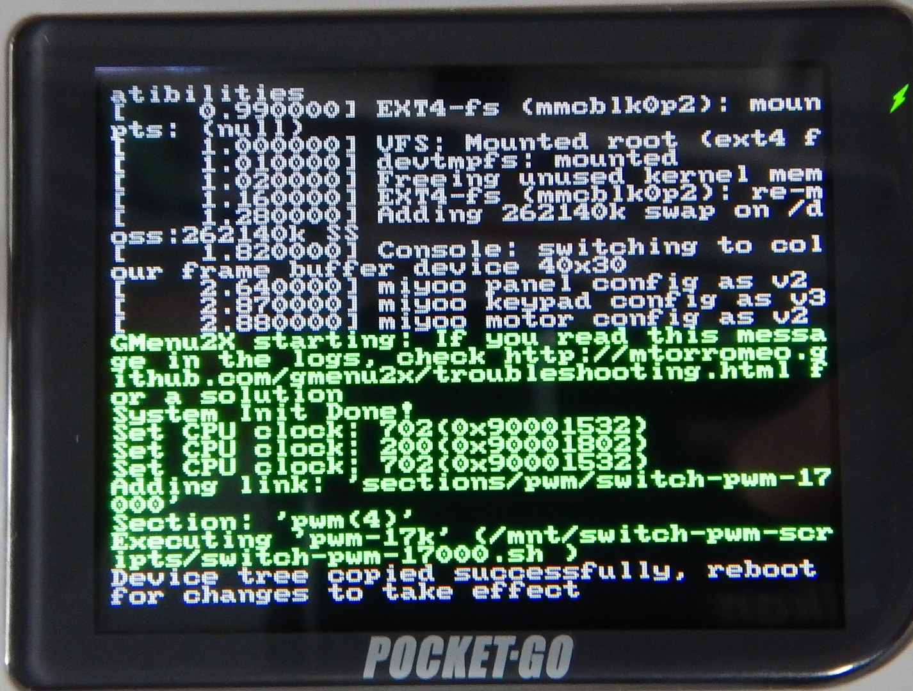

## Modifying the Pocket-Go PWM frequency

Thanks to BytePorter for [this guide](https://byteporter.com/pocket-go-pwm-script-install). _This may work also for Bittboy v3/3.5_

I recently picked up a Pocket-Go portable game console. It’s a neat little device based on an Allwinner F1C100S SoC, an old chip with an ARM9 core at up to 900MHz and 32MB RAM built in. The device runs Linux off of an SD card so some more hacking might be in store for the future. One issue that seems to be common with it however is an annoying buzzing sound that comes out of the speaker. Another owner asked support about it and they said it could be mitigated by turning the brightness up (link). That immediately made it sound to me like the PWM circuit which controls the brighness of the backlight was introducing noise into the audio circuit.

I had a look at the device tree file on the SD card and sure enough the PWM frequency was set to 1000 Hz, which is easily audible. I read up a bit on the device tree bindings for the pwm-backlight driver in the documentation for the Linux kernel and found that the third value of the “pwms” attribute of the “backlight” section in the device tree specifies the period of the pwm in nanoseconds. Changing this to an inaudible frequency should help with the noise, so I tried a couple and found 17kHz to work well for me. If you go too fast, the backlight seems to loose some of its adjustment levels. 17kHz is inaudible for many adults, though younger people or people with great hearing may still hear it. It also doesn’t remove all of the noise as the design most likely lacks proper isolation on the circuit level, but it definitely helps as far as my own ear is concerned. I created a generator to build the modified device tree and put it in a shell script that can be run on the Pocket-Go in order to change the PWM frequency. I generated a handful of values that I thought might be useful for people but an arbitrary frequency is easily generated too.

Here you’ll find instructions on how to get these scripts onto your Pocket-Go and add them to the launcher so that you can run them and try this fix for yourself!

### WARNING

This will change the parameters of the driver for the PWM backlight. The way the backlight works is essentially by flicking the power switch for the LED on and off very quickly, faster than your eye can see. The amount of time the switch stays on each cycle determines the brightness of the backlight. This software will tell the driver to flick this LED on and off much faster. As far as I know, this shouldn’t be able to damage the hardware and I personally have not had issues on mine. However, I studied computer science, not electrical engineering, so all of my solutions only work in theory ;).

**Use this at your own risk!** I would feel awful if someone damaged their Pocket-Go using this, but I’m only trying to be helpful and releasing this work for people to try for free. I can’t assume responsibility for any damage that results.

### Instructions

Ok, with the warning out of the way, let’s get down to business. I whipped up a quick tool to generate device trees for whatever frequencies we want. It then compresses and encodes this device tree into a shell script that you can run from your Pocket-Go to change the tree used to boot the system, thus changing the PWM frequency. You can see the source code for this on my github. I used it to create scripts for 1000 (the stock value), 15000, 17000, 20000, and 25000 Hz settings for the PWM. Ideally we’d just use the fastest but it seems to be unable to allow for as fine an adjustment the faster you go resulting in fewer brightness levels being available. 17000 Hz works well for me and most adults probably can’t really hear that frequency either, so that’s what I’d recommend.

I was under the impression that Windows only mounted the very last partition which is why I went through the trouble to package the device tree into scripts that could run on the Pocket-Go. However as you can see, at least on my tablet using the included USB card reader, all four show up. So I could have just provided the device trees for people to copy onto the boot partition I guess. Oh well, this is still a convenient way to easily switch between them in case not everyone wants to use 17000 Hz.

1. Remove the SD card from your Pocket-Go and insert it into the USB reader that came with it. Plug this into your PC.

2. DO NOT format the card when Windows asks. That will erase your firmware and you’ll have to go download and install it all over again.

3. Download the archive: [switch-pwm-scripts.tgz](assets/Switch_PWM_Scripts.tgz)

4. Extract the archive to a new folder (mine is named switch-pwm-scripts).
   
   Extracting 

5. Copy the folder with the scripts to the last and largest partition on the SD card, which in my case was mounted to G:.
   
   Copying the folder 

6. Eject the SD card from your PC, remove it from the reader, and put it back in your Pocket-Go, and turn on the Pocket-Go.

7. Once it boots, press ‘select’ and choose ‘Add section’.
   
   Add a new section 

8. This will be a new section in your launcher where we’ll put links to run the PWM scripts so name it appropriately. I chose ‘PWM’ for mine.
   
   Name the section 

9. Use the shoulder buttons to navigate to the section you just created and press ‘select’ again. Choose ‘Add link’.
   
   Add a new link 

10. You will be asked to select an application with a file browser. It should start you in the root directory of the SD card’s last partition. Navigate to the folder you copied over which in my case is ‘switch-pwm-scripts’.
    
     Select scripts folder 

11. In that folder, select the script for whichever frequency you want. I use 17000Hz, which is named switch-pwm-17000.sh.
    
    Select the script 

12. The default name is truncated from the script to ‘script-pwm..’ which you won’t be able to tell apart from the other versions of the script if you choose to add more. Choose ‘Title’ from the Edit menu and press ‘A’ to edit the name. I named mine ‘pwm-17k’.
    
    Choose Title to edit the name
    
    Give it an appropriate name

13. (Optional) Repeat the last four steps to add whichever versions of the script you’d like to be able to run.

14. Select the link to the script you’d like to run and press ‘A’ to run it.
    
    Run the script

15. The script should run and you’ll see a message telling you it was successful and that you need to reboot for it to take effect. Wait for this message to disappear after 5 seconds and then reboot your Pocket-Go as you normally would.
    
    Script successfully completed

That’s it! Your Pocket-Go should reboot like normal and hopefully the buzzing noise from your speaker will be greatly reduced.

### Final Thoughts

This fix greatly reduced the unwanted noise coming from the speaker on my Pocket-Go, but it didn’t completely remove it. Particularly, I can still hear noise on mine when the volume is turned up and also some noise when the Pocket-Go is booting. I don’t think this can be addressed with software, I’d imagine the audio circuit is just not well isolated in general. However, this made mine much better and I can’t hear excess noise unless I turn the volume up very loud. As the speaker can go much louder than I need anyway, I just don’t turn it up all the way. Good luck! Hope this mitigates the issue for everyone else too.