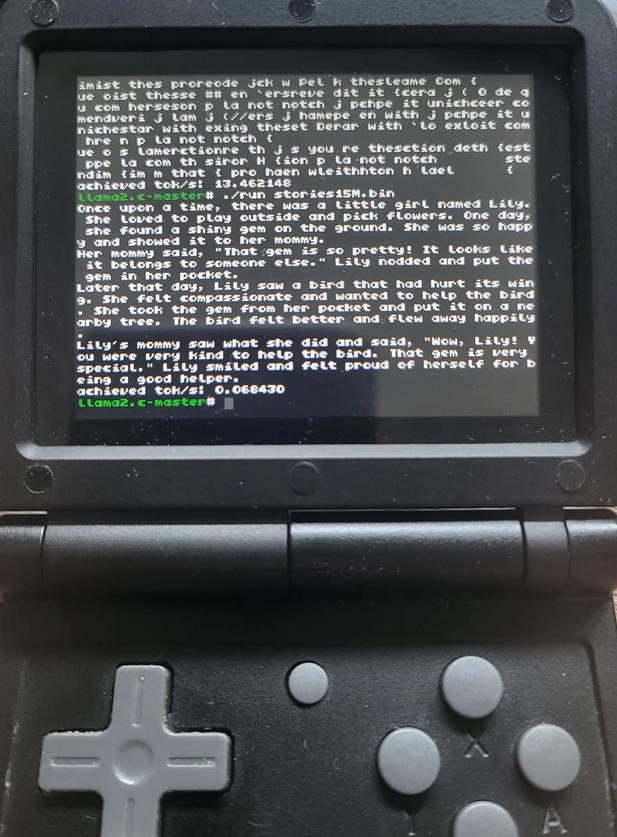

_Original post by [Ordinary_Tension5730](https://www.reddit.com/r/PowKiddy/comments/1cwnezf/tiny_llm_on_v90_miyoo_cfw)_

Hello,\
Today, I managed to get the `llama2.c` project running on my powkiddy v90 with the miyoo cfw. If anyone wants to give it a go, let's go.

First of all, I wanted to thank Apaczer from the git MiyooCFW for providing me with some useful links.
To start with, you need to be on a Linux distribution, personally, I'm on a debian bookworm.
Then you need to download the external toolchain or compile it.

For beginners I advise you to use the following link: https://github.com/MiyooCFW/toolchain/releases

And download the already compiled tar.gz and decompress it in the `/opt/miyoo` folder with a `tar -xvf`
Once the toolchain has been extracted, you need to download the git `llama2.c` using the following command in the `/opt` folder:
```
git clone https://github.com/karpathy/llama2.c.git
```
If you've succeeded, you now have a llama2.c folder in the /opt folder.
Now you need to compile the run.c file using the external toolchain.\
You should use a command like :

```
./arm-buildroot-linux-musleabi-gcc -Ofast -march=armv5te -o /opt/run /opt/llama2.c/run.c -lm -funroll-all-loops
```

In order to find the gcc for arm you have to search in the toolchain in the bin folder (/opt/miyoo/arm-buildroot-linux-musleabi_sdk-buildroot/bin).\
If you get this error:

```
error: unknown type name 'int8_t'; did you mean 'intptr_t'?
```

You need to add this line to the `run.c` file in llama2.c folder
```
include <stdint.h>
```

You should now have a file called run in the `/opt` folder.
All that's left to do is add it to the rest of the `llama2.c` folder and add the whole llama2.c folder to your console.
Personally, I put it in the script folder I created for the occasion.
Final step to do is download one of the test models found on this page in the models section:

https://github.com/karpathy/llama2.c

Start by testing with the 260K which is mediocre in result but has good performance to see if everything is fine.
You need to add the models to the `llama2.c` folder in the console and run the script.
Here are some images of the two smallest models.



Sources:
- https://github.com/karpathy/llama2.c?tab=readme-ov-file thanks to Andrej Karpathy for that
- https://github.com/MiyooCFW thanks to Apaczer and all contributors
- https://www.reddit.com/r/LocalLLaMA/comments/1cpy0w0/tinystories_llm_in_cheap_lowmem_4_computer_from for the idea 